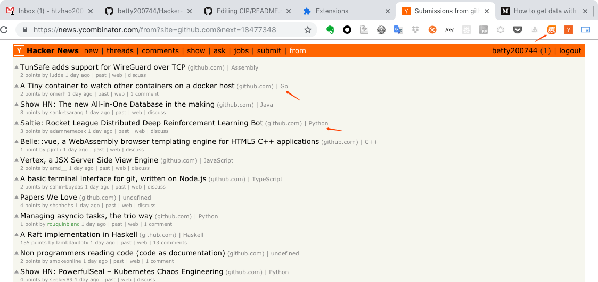

# Hacker-Tag

Hacker-Tag is short for **Hacker News Extension With github language tags**. It can show github language tag in `https://news.ycombinator.com/from?site=github.com` .

## How to use it

When you open `https://news.ycombinator.com/from?site=github.com`, then it will auto show the language tags.

## Screenshot

## Chrome extension store

[Download link](https://chrome.google.com/webstore/detail/cip/oacpifbefgeacllmohgglfjmgchadkjh)
